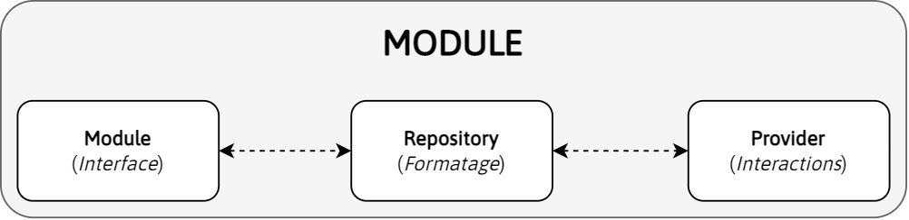

# APIS

La gestion des APIS (c'est-à-dire des différents services scolaires) est assez complexe et nécessite une section dédiée.

## Fonctionnement

### Architecture modulaire

Une API fonctionne de façon modulaire. En effet, un service scolaire A peut disposer de modules X et Y tandis qu'un service B ne disposera que du module X. (Par module on entend un ensemble de fonctionnalités gérées par le service, par exemples les notes).

L'API a donc une structure modulaire pour permettre de gérer la disponibilité des modules à l'échelle du service, mais aussi de l'utilisateur. En effet, certains modules ne sont disponibles qu'en fonction du choix de l'emplacement. Il est donc possible de définir ces disponibilités de façon dynamique (normalement lors de l'authentification).

Un module dispose d'une interface faites de _getters_ et de méthodes. Les éventuelles variables muables sont privées et des getters sont utilisés pour les récupérer. Par exemple :

```dart
bool _status = false;
bool get status => _status;
```

Toute méthode peut être écrasé pour des besoins spécifiques à un service, même s'il est préférable que ce ne soit pas le cas. Par exemple, un calcul de moyenne pourrait être différent pour un service X et dans ce cas, il est possible de changer la méthode de calcul spécifiquement pour ce service sans modifier celle des autres et en gardant la même interface (paramètres et retour).

### Disponibilité des modules

Il existe donc une classe abstraite `SchoolApi` que toute API doit hériter (plus de détails dans une prochaine section).

Chaque module est dit disponible selon 2 critères :

- est-ce que le module a été implémenté pour le service (`ModulesSupport`)
- est-ce que l'utilisateur dispose du module (`ModulesAvailability`)

Ainsi, certaines pages ne sont accessibles que si le module est implémenté et que l'utilisateur dispose du module.

### Données hors ligne

Par défaut, les données retournées par un module sont stockées en hors ligne. Cela permet à l'utilisateur d'avoir directement accès à ses données sans devoir attendre qu'une requête http soit effectuée.

Chaque module possède une méthode `fetch` qui permet de récupérer les données en ligne. Le comportement de chaque module n'est cependant pas le même: certains écrasent les données, d'autres mettent à jour, cela dépend.

Chaque module possède également une méthode `reset` pour supprimer les données stockées au besoin.

### Rôle par fichier

Un module est en fait réparti en 3 fichiers :

- `module.dart` : c'est l'interface qui permet d'interagir avec la donnée
- `repository.dart` : c'est la classe qui formate les données
- `provider.dart`: c'est la classe qui interagit avec le service scolaire, en ligne



## Ajouter un module

> Pour faciliter la compréhension, le module utilisé dans cet exemple aura pour nom `Cantine` et le modèle `Repas`.

Voici un aperçu des étapes :

1. Ajouter les fichiers du module dans `/lib/core/src/api/school_api/src/modules/cantine/`
2. Créer les modèles si nécessaire dans `/lib/core/src/api/school_api_models/src/repas.dart`
3. Exécuter `build_runner`
4. Créer la logique
5. Ajouter le module dans `SchoolApiModules`
6. Ajouter une entrée à `ModulesSupport` et `ModulesAvailability`
7. Ajouter le nouveau module à **tous** les services

> **IMPORTANT**
>
> Pour être sûr que votre module ne rompe pas avec la vision des développeurs, merci de faire part de votre idée en premier lieu sur Discord ou via une issue Github.

### 1. Création du module

Un module est composé de 2 fichiers :

- `module.dart`: le module en lui-même, c'est-à-dire une classe qui hérite de `Module`
- `repository.dart` (Optionnel): si le module nécessite de récupérer/interagir avec les données de plusieurs façons, ajouter ce fichier est nécessaire

Pour notre exemple, nous allons créer un module `Cantine` qui peut récupérer la liste de tous les repas de l'élève et qui peut également ajouter un repas. Nous aurons donc besoin de 2 fichiers.

Commençons par créer le repository. Créons un fichier `/lib/core/src/api/school_api/src/modules/cantine/repository.dart` :

```dart
part of school_api;

abstract class CantineRepository extends Repository {
  CantineRepository(SchoolApi api) : super(api);

  Future<Response<void>> add(Meal meal);
}
```

Lors de l'implémentation du repository dans un service, 2 méthodes seront disponibles: `fetch` et `add`.

Il faut maintenant ajouter le fichier dans `/lib/core/src/api/school_api/school_api.dart` :

```diff
// DOCUMENTS MODULE
part 'src/modules/documents/module.dart';
part 'src/modules/documents/repository.dart';

+ // CANTINE MODULE
+ part 'src/modules/cantine/repository.dart';
```

Et maintenant le fichier du module en lui-même (`/lib/core/src/api/school_api/src/modules/cantine/repository.dart`) :

```dart
part of school_api;

abstract class CantineModule<R extends CantineRepository> extends Module<R> {
  CantineModule({required R repository, required SchoolApi api})
      : super(
          isSupported: api.modulesSupport.cantine,
          isAvailable: api.modulesAvailability.cantine,
          repository: repository,
          api: api,
        );

  @override
  Future<Response<void>> fetch() async {
    return const Response(error: "Not implemented");
  }

  @override
  Future<void> reset() async {}
}
```

Et encore une fois ajouter ce fichier dans `/lib/core/src/api/school_api/school_api.dart` :

```diff
// CANTINE MODULE
+ part 'src/modules/cantine/module.dart';
part 'src/modules/cantine/repository.dart';
```

Des erreurs au niveau de `isSupported` et `isAvailable` sont détectées mais nous nous en occuperons un peu plus tard.

### 2. Création du modèle

Nous avons donc besoin d'un modèle `Repas` aux caractéristiques suivantes:

|      | Id     | UserId   | Date       | Content  |
| ---- | ------ | -------- | ---------- | -------- |
| Type | `int?` | `String` | `DateTime` | `String` |

Dans notre situation, tous ces propriétés sont immuables.

Nous allons donc ajouter le modèle dans `/lib/core/src/api/school_api_models/src/repas.dart` :

```dart
part of models;

@Collection()
class Repas {
  @Id()
  int? id;
  final String userId;
  final DateTime date;
  final String content;

  Repas({
    required this.userId,
    required this.date,
    required this.content
  });
}
```

> Pour ne pas surcharger ce guide, ce modèle n'est pas documenté mais sachez que toute _Pull Request_ non documentée sera mise en attente en attendant que l'auteur documente son code.

Et ici aussi il faut ajouter le fichier à la librairie dans `/lib/core/src/api/school_api_models/school_api_models.dart` :

```diff
part 'src/recipient.dart';
part 'src/school_account.dart';
part 'src/school_life_sanction.dart';
part 'src/school_life_ticket.dart';
+ part 'src/repas.dart';
```

### 3. Exécuter `build_runner`

Dans la section suivante, nous avons utilisé des _decorators_ qui permettent de générer du code et intégrer le modèle dans le système de base de données.

Pour cela, il suffit d'exécuter la commande suivante à la racine du projet :

```bash
$ flutter packages pub run build_runner build --delete-conflicting-outputs
```

### 4. Créer la logique

Nous voulons donc pour ce module est logique assez simple : récupérer tous les repas et pouvoir en ajouter un.

Nous nous sommes déjà occupés du repository, nous allons donc créer la logique du module en lui-même.

Le module doit permettre d'accéder à la liste de tous les repas, nous allons donc utiliser un _getter_ qui récupère les repas stockés hors ligne. La variable `offline` que nous utilisons pour ce faire est injectée automatiquement.

Dans notre fichier `module.dart`, en dessous du constructeur on ajoute :

```dart
List<Repas> get repas {
  final _repas = offline.repas.where().sortByDate().build().findAllSync();
  return _repas;
}
```

Tout repository dispose d'une méthode `get` qui doit renvoyer `Future<Response<Map<String, dynamic>>>`. Notre repository devra donc renvoyer une `Map` dans le format suivant :

```dart
final Map<String, dynamic> result = {
  "repas": <Repas>[] // Vide pour l'explication
};
```

On peut donc s'occuper de `fetch`.

```dart
@override
Future<Response<void>> fetch() async {
  if (fetching) {
    return const Response(error: "Already fetching");
  }
  fetching = true;
  notifyListeners();
```

Maintenant que nous annonçons la récupération des données, nous pouvons réellement les demander.

```dart
final res = await repository.get();
if (res.error != null) return res;
final List<Repas> _repas = res.data!["repas"] ?? [];
```

On stocke maintenant les repas dans la base de données.

```dart
await offline.writeTxn((isar) async {
  await isar.repas.clear();
  await isar.repas.putAll(_repas);
});
```

```dart
fetching = false;
notifyListeners();
Logger.log("CANTINE MODULE", "Fetch successful");
return const Response();
}
```

Il faut maintenant pouvoir ajouter un repas :

```dart
Future<Response<void>> add(Repas repas) async {
  final res = await repository.add(repas);
  if (res.error != null) return res;
  await offline.writeTxn((isar) async {
    await isar.repas.put(repas);
  });
  return const Response();
}
```

### 5. Ajouter le module dans `SchoolApiModules`

Dans `/lib/core/src/api/school_api/src/school_api_modules.dart` on ajoute la ligne suivante :

```diff
part of school_api;

abstract class SchoolApiModules {
  late AuthModule authModule;

  late GradesModule gradesModule;

  late SchoolLifeModule schoolLifeModule;

  late EmailsModule emailsModule;

  late HomeworkModule homeworkModule;

  late DocumentsModule documentsModule;

+ late CantineModule cantineModule;
}
```

### 6. Ajouter une entrée à `ModulesSupport` et `ModulesAvailability`

Dans `/lib/core/src/api/school_api/src/modules_support.dart` on modifie le fichier de la façon suivante :

```diff
part of school_api;

class ModulesSupport {
  final bool grades;
  final bool schoolLife;
  final bool emails;
  final bool homework;
  final bool documents;
+ final bool cantine;

  const ModulesSupport({
    required this.grades,
    required this.schoolLife,
    required this.emails,
    required this.homework,
    required this.documents,
+   required this.cantine
  });
}
```

De la même façon dans `/lib/core/src/api/school_api/src/modules_availability.dart` :

```diff
part of school_api;

class ModulesAvailability {
  bool grades;
  bool schoolLife;
  bool emails;
  bool homework;
  bool get documents => emails || homework;
+ bool cantine;

  ModulesAvailability({
    this.grades = false,
    this.schoolLife = false,
    this.emails = false,
    this.homework = false
+   this.cantine = false
  });

  static const String _offlineKey = "modulesAvailability";

  Future<void> load() async {
    final String? data = await KVS.read(key: _offlineKey);
    if (data == null) {
      await save();
      return;
    }
    final Map<String, dynamic> decoded = json.decode(data);
    grades = decoded["grades"] as bool;
    schoolLife = decoded["schoolLife"] as bool;
    emails = decoded["emails"] as bool;
    homework = decoded["homework"] as bool;
+   cantine = decoded["cantine"] as bool;
  }

  Future<void> save() async {
    await KVS.write(
        key: _offlineKey,
        value: json.encode({
          "grades": grades,
          "schoolLife": schoolLife,
          "emails": emails,
          "homework": homework,
+         "cantine": cantine
        }));
  }
}
```

### 7. Ajouter le nouveau module à **tous** les services

Lors de l'ajout d'un module, l'implémentation concrète pour un service est normalement réalisé.

**TODO: check if could be optimized.**

## Ajouter un service scolaire

A venir
